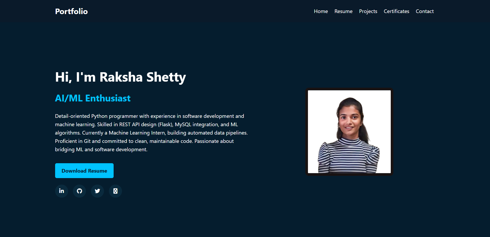
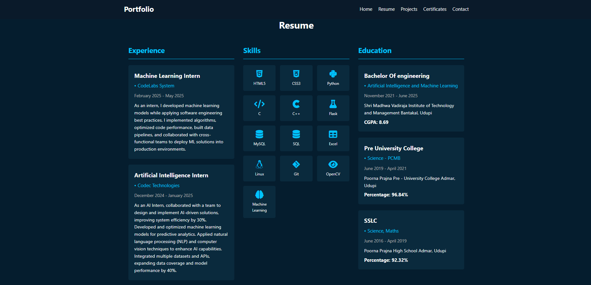
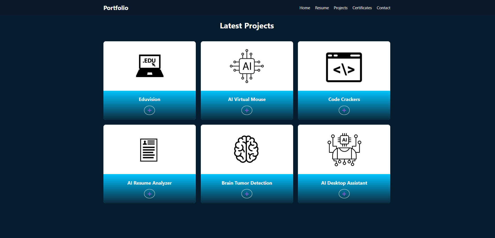
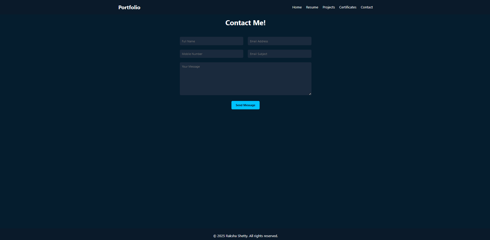

# 🌟 My Portfolio Website

Welcome to my personal portfolio website! This website highlights my experience, skills, projects, and certifications, making it easy for recruiters and connections to learn more about me.

## 🚀 Features

- **🏠 Home (About Me)** – A brief introduction about myself.
- **📄 Resume**  
  - **💼 Experience** – Details of my internships and work experience.  
  - **🛠 Skills** – My technical and professional skill set.  
  - **🎓 Education** – My academic background.  
- **📌 Projects** – Showcasing my best projects with descriptions and links.  
- **🏅 Certifications** – Certifications I have earned.  
- **📞 Contact** – Ways to reach out to me .

---

📸 **Screenshots**  
### Home Page  

### Resume Page 
 

### Projects Page

### Certificates Page

### Contact Me Page

---
📌 **Live Demo**
[Visit My Portfolio](https://portfolio-shettyraksha.vercel.app/)

---

